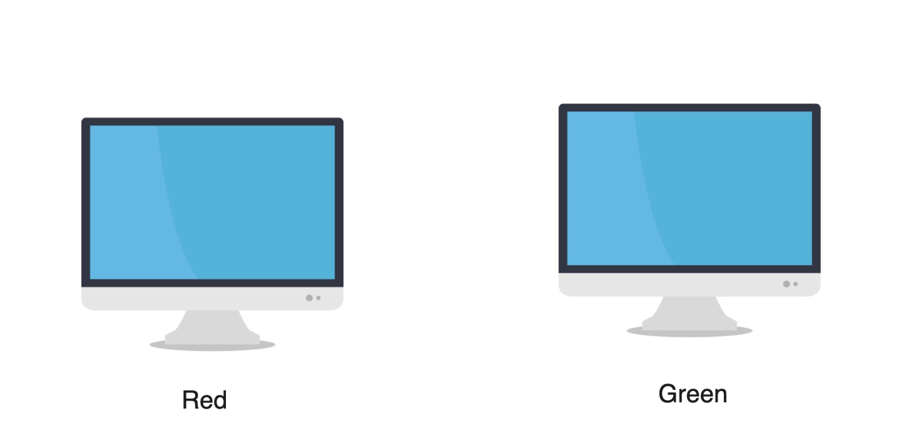
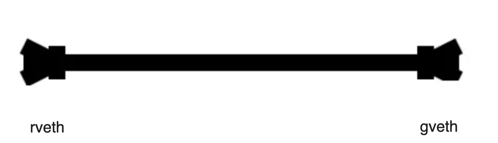
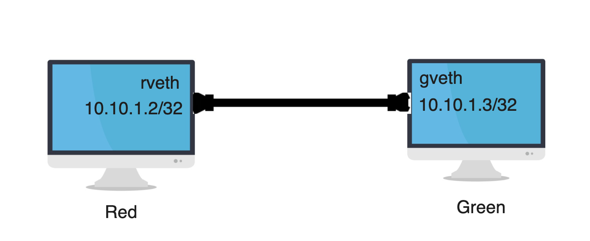

# network-namespaces

We will create two different network namespaces, and then the network namespaces will connect to each other like two computers.

## Created two different network namespaces
    sudo ip netns add red
    sudo ip netns add green
## Show network namespace
    sudo ip netns list

<figure >

  
  
Dataflow Diagram

</figure>

## Add a virtual ethernet peer between the two namespaces

    sudo ip link add rveth type veth peer name gveth

  <figure >

  
  
Dataflow Diagram

</figure>

## Show virtual ethernet list
    sudo ip link list

## Assign one end of the peer to red and the other end of the peer to green:

    sudo ip link set rveth netns red
    sudo ip link set gveth netns green

  
  
Dataflow Diagram

</figure>

## The virtual ethernets have been assigned to the namespaces. A veth device can be assigned to only one network namespace. Let’s have a look at the red network namespace

    sudo ip netns exec red bash

    ip addr

lo: <LOOPBACK> mtu 65536 qdisc noop state __DOWN group__ default qlen 1000
link/loopback 00:00:00:00:00:00 brd 00:00:00:00:00:00

4: rveth@if3: <BROADCAST,MULTICAST> mtu 1500 qdisc noop state __DOWN group__ default qlen 1000
link/ether 32:93:02:e6:97:ea brd ff:ff:ff:ff:ff:ff link-netnsid 1

## The red network namespace has two ethernet devices: lo and rveth They are not enabled (UP) yet. Let’s enable those interfaces:

    ip link set dev lo up
    ip link set dev rveth up
    ip addr

1: lo: <LOOPBACK,UP,LOWER_UP> mtu 65536 qdisc noqueue state __UNKNOWN group__ default qlen 1000
link/loopback 00:00:00:00:00:00 brd 00:00:00:00:00:00 inet 127.0.0.1/8 scope host lo valid_lft forever preferred_lft forever inet6 ::1/128 scope host valid_lft forever preferred_lft forever

4: rveth@if3: <NO-CARRIER,BROADCAST,MULTICAST,UP> mtu 1500 qdisc noqueue state __LOWERLAYERDOWN group__ default qlen 1000 link/ether be:3b:96:51:ac:9c brd ff:ff:ff:ff:ff:ff link-netnsid 1

## They don’t have an IP address, though. Let’s assign some IP addresses in red namespace:

    ip addr add 10.10.1.2/32 dev rveth

    ip addr

 4: rveth@if3: <NO-CARRIER,BROADCAST,MULTICAST,UP> mtu 1500 qdisc noqueue state LOWERLAYERDOWN group default qlen 1000 link/ether be:3b:96:51:ac:9c brd ff:ff:ff:ff:ff:ff link-netnsid 1 inet __10.10.1.2/32__ scope global rveth
       valid_lft forever preferred_lft forever

    exit

## The virtual ethernets have been assigned to the namespaces. A veth device can be assigned to only one network namespace. Let’s have a look at the green network namespace

    sudo ip netns exec green bash
    ip addr

1: lo: <LOOPBACK> mtu 65536 qdisc noop state __DOWN group__ default qlen 1000
    link/loopback 00:00:00:00:00:00 brd 00:00:00:00:00:00

3: gveth@if4: <BROADCAST,MULTICAST> mtu 1500 qdisc noop state __DOWN group__ default qlen 1000
    link/ether d2:f9:47:c6:d5:58 brd ff:ff:ff:ff:ff:ff link-netnsid 0

## The green network namespace has two ethernet devices: lo and rveth They are not enabled (UP) yet. Let’s enable those interfaces:

    ip link set dev lo up
    ip link set dev gveth up

1: lo: <LOOPBACK,UP,LOWER_UP> mtu 65536 qdisc noqueue state __UNKNOWN group__ default qlen 1000
    link/loopback 00:00:00:00:00:00 brd 00:00:00:00:00:00
    inet 127.0.0.1/8 scope host lo
       valid_lft forever preferred_lft forever
    inet6 ::1/128 scope host 
       valid_lft forever preferred_lft forever

3: gveth@if4: <BROADCAST,MULTICAST,UP,LOWER_UP> mtu 1500 qdisc noqueue state __UP group__ default qlen 1000
    link/ether d2:f9:47:c6:d5:58 brd ff:ff:ff:ff:ff:ff link-netnsid 0
    inet6 fe80::d0f9:47ff:fec6:d558/64 scope link 
       valid_lft forever preferred_lft forever

## They don’t have an IP address, though. Let’s assign some IP addresses in green namespace:

    ip addr add 10.10.1.3/32 dev gveth
    ip addr

3: gveth@if4: <BROADCAST,MULTICAST,UP,LOWER_UP> mtu 1500 qdisc noqueue state UP group default qlen 1000
    link/ether d2:f9:47:c6:d5:58 brd ff:ff:ff:ff:ff:ff link-netnsid 0
    inet __10.10.1.3/32__ scope global gveth
       valid_lft forever preferred_lft forever
    inet6 fe80::d0f9:47ff:fec6:d558/64 scope link 
       valid_lft forever preferred_lft forever

<figure >

  
  
Dataflow Diagram

</figure>

## ping green namespace
    ping 10.10.1.2
__connect: Network is unreachable__
Because we can not add route

## Add route in green namespace
    ip route add 10.10.1.2/32 dev gveth
    route
Kernel IP routing table
Destination     Gateway         Genmask         Flags Metric Ref    Use Iface
10.10.1.2       0.0.0.0         255.255.255.255 UH    0      0        0 gveth

    exit

## Add route in red namespace
    sudo ip netns exec red bash
    ip route add 10.10.1.3/32 dev rveth
    route 
Kernel IP routing table
Destination     Gateway         Genmask         Flags Metric Ref    Use Iface
10.10.1.3       0.0.0.0         255.255.255.255 UH    0      0        0 rveth

    ping 10.10.1.3

PING 10.10.1.3 (10.10.1.3) 56(84) bytes of data.
64 bytes from 10.10.1.3: icmp_seq=1 ttl=64 time=0.126 ms
64 bytes from 10.10.1.3: icmp_seq=2 ttl=64 time=0.102 ms
64 bytes from 10.10.1.3: icmp_seq=3 ttl=64 time=0.103 ms
64 bytes from 10.10.1.3: icmp_seq=4 ttl=64 time=0.103 ms
64 bytes from 10.10.1.3: icmp_seq=5 ttl=64 time=0.102 ms

__ping successfully work__

